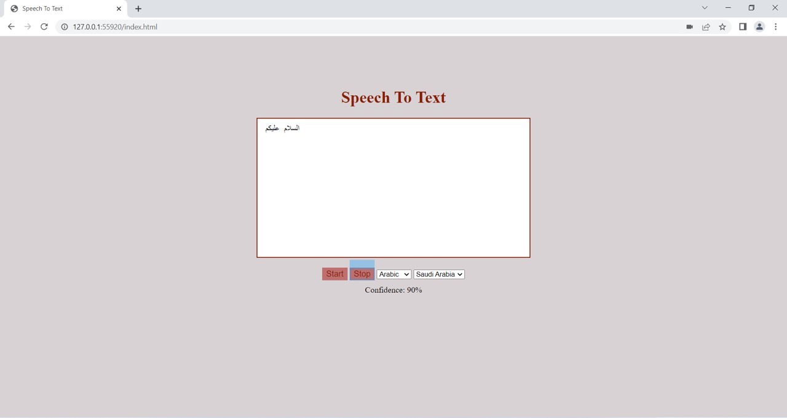

# speech-to-text-
Build Speech to Text in Javascript Using Web Speech Recognition API.

Speech-to-text javascript web API is free for web users and supports more than 40+ languages.

This project focuses on Arabic and English languages and their dialects. 

Arabic is the default language

but you can change the language by clicking on the arrow.

After that, you can select what accent/tone/dialect you want.

 

  
  

you can change the language/accent anytime 

Click on the "start" button to start the speech 
the page will be asking you to allow to use your mic

when the recognition begins; you will see "Listing... Please Speak" 

now it converts your speech to text

  
  

page link : http://127.0.0.1:59649/index.html
